<div align="center">
  
# 👋 Hello, I'm dzp5103


[](https://github.com/dzp5103)
[](https://github.com/dzp5103?tab=followers)
[](https://github.com/dzp5103)
[](https://github.com/dzp5103)


</div>

---


## 🚀 About Me

```typescript
const developer = {
    name: "dzp5103",
    title: "Full-Stack Developer",
    location: "Earth 🌍",
    code: ["JavaScript", "TypeScript", "Python", "Java", "Go"],
    technologies: {
        frontEnd: ["React", "Vue.js", "Next.js", "Svelte"],
        backEnd: ["Node.js", "Express", "Django", "FastAPI"],
        databases: ["MongoDB", "PostgreSQL", "Redis", "Firebase"],
        cloud: ["AWS", "Azure", "GCP", "Docker", "Kubernetes"],
        tools: ["Git", "VS Code", "Figma", "Postman"]
    },
    currentFocus: "Building scalable web applications",
    funFact: "I debug with console.log and I'm not ashamed! 🐛"
};
```

---

## 🛠️ Tech Stack

<div align="center">

### Frontend


### Backend


### Database & Cloud


### Tools & Platforms


</div>

---

## 📊 GitHub Analytics

<div align="center">
  
  
</div>

<div align="center">
  <p><small>📊 <em>Stats widgets may take a moment to load or may be temporarily unavailable due to API rate limits</em></small></p>
</div>

<div align="center">
  
  <p><small>🔥 <em>Streak stats may be temporarily unavailable</em></small></p>
</div>

<div align="center">
  
</div>

---

## 🏆 GitHub Trophies

<div align="center">
  
</div>

---

## 📈 Contribution Graph

<div align="center">
  
</div>

---

## 🐍 Contribution Snake

<div align="center">
  
</div>

---

## 🔥 Trending & Discovery

<div align="center">

### 📈 GitHub Trending Today


### 🌟 Discover Repositories
[](https://github.com/sindresorhus/awesome)
[](https://github.com/ellerbrock/open-source-badges/)

</div>

<table>
<tr>
<td width="50%">

### 🚀 Hot Topics
- 
- 
- 
- 
- 

</td>
<td width="50%">

### 📊 Weekly Focus Areas
```text
Frontend Development    ████████████░   85%
Backend Architecture    ██████████░░░   75%
Cloud Infrastructure    ████████░░░░░   65%

</td>
</tr>
</table>

---

## 🎯 Current Focus

```mermaid
graph TD
    A[🚀 Current Projects] --> B[Web Development]
    A --> C[Open Source]
    A --> D[Learning]
    
    B --> E[Next.js Applications]
    B --> F[API Development]
    
    C --> G[Contributing to OSS]
    C --> H[Maintaining Projects]
    
    D --> I[Cloud Technologies]
    D --> J[System Design]
```

<div align="center">



</div>

- 🔭 Currently working on **scalable web applications**
- 🌱 Learning **microservices architecture** and **system design**
- 👯 Looking to collaborate on **open source projects**
- 💬 Ask me about **JavaScript, React, Node.js, or system architecture**
- ⚡ Fun fact: **I believe great code is like poetry - it should be beautiful and meaningful**

---

## 📫 Let's Connect

<div align="center">

[](https://linkedin.com/in/dzp5103)
[](https://twitter.com/dzp5103)
[](https://dzp5103.github.io)
[](mailto:dzp5103@gmail.com)
[](https://github.com/dzp5103)

</div>

---

## 💻 Weekly Development Breakdown

<!--START_SECTION:waka-->
```text
⚙️ Setting up WakaTime integration...

To see your real coding time stats here:
1. Sign up at https://wakatime.com/
2. Install WakaTime plugin in your IDE
3. Add WAKATIME_API_KEY to repository secrets
4. Stats will automatically update daily!

Meanwhile, here's a sample of what you'll see:
JavaScript   12 hrs 30 mins  ████████████░░░░░░░░░░░░░   48.2%
TypeScript   6 hrs 45 mins   ██████░░░░░░░░░░░░░░░░░░░   26.1%
Python       3 hrs 20 mins   ███░░░░░░░░░░░░░░░░░░░░░░   12.9%
CSS          2 hrs 15 mins   ██░░░░░░░░░░░░░░░░░░░░░░░    8.7%
HTML         1 hr 5 mins     █░░░░░░░░░░░░░░░░░░░░░░░░    4.1%
```
<!--END_SECTION:waka-->

---

## 🎨 Featured Projects

<div align="center">

[](https://github.com/dzp5103/dzp5103)

</div>

<div align="center">
  
**More repositories coming soon! 🚀**  
*Currently building amazing projects to showcase here*

</div>

---

## 📈 Trending Repositories

<div align="center">

### 🌟 Today's Hot Repositories
[](https://github.com/trending/javascript)
[](https://github.com/trending/typescript)
[](https://github.com/trending/python)

</div>

<table>
<tr>
<td width="50%">

### 🔥 Trending by Language
- [](https://github.com/trending/javascript) **JavaScript**
- [](https://github.com/trending/typescript) **TypeScript**
- [](https://github.com/trending/python) **Python**
- [](https://github.com/trending/go) **Go**
- [](https://github.com/trending/rust) **Rust**

</td>
<td width="50%">

### 📊 Repository Categories
- [](https://github.com/topics/web-development) **Web Development**
- [](https://github.com/topics/machine-learning) **AI & Machine Learning**
- [](https://github.com/topics/devops) **DevOps & Infrastructure**
- [](https://github.com/topics/mobile) **Mobile Development**
- [](https://github.com/topics/blockchain) **Blockchain & Web3**

</td>
</tr>
</table>

### 🎯 Interactive Repository Explorer

<div align="center">

[](https://github.com/trending)
[](https://github.com/topics)
[](https://github.com/collections)

</div>

---

## 📚 Learning & Resources

<div align="center">

### 🎓 Today's Learning Focus


</div>

<table>
<tr>
<td width="50%">

### 📖 Current Reading
- 📚 **Clean Architecture** by Robert Martin
- 🌐 **System Design Interview** by Alex Xu
- 🔧 **Designing Data-Intensive Applications**
- 🚀 **The Pragmatic Programmer**
- 💡 **You Don't Know JS** series

### 🎯 Learning Goals 2024
- [ ] Master Kubernetes & Microservices
- [ ] Deep dive into System Design
- [ ] Contribute to major OSS projects
- [ ] Learn Rust programming
- [ ] Build scalable distributed systems

</td>
<td width="50%">

### 🌟 Recommended Resources
[](https://freecodecamp.org)
[](https://coursera.org)
[](https://udemy.com)
[](https://developer.mozilla.org)

### 🔗 Useful Links
- [📰 Dev.to](https://dev.to/) - Developer Community
- [🧠 Leetcode](https://leetcode.com/) - Coding Practice
- [🎨 Dribbble](https://dribbble.com/) - Design Inspiration
- [🐦 Tech Twitter](https://twitter.com/search?q=%23webdev) - Latest Trends

</td>
</tr>
</table>

---

## 💡 Random Dev Quote

<div align="center">


</div>

---

## 🎵 Spotify Playing

<div align="center">

<!-- Replace 'yourusername' with your actual Spotify username -->
<!-- To set up: Visit https://github.com/novatorem/novatorem for setup instructions -->
[](https://open.spotify.com/user/dzp5103)

<p><em>🎵 Currently listening to music or recently played tracks will appear here</em></p>
<p><small>⚙️ <a href="https://github.com/novatorem/novatorem">Set up Spotify integration</a> to show your real-time music activity</small></p>

</div>

---

## 🌍 Open Source Contributions

<div align="center">

### 📊 Contribution Overview


</div>

<table>
<tr>
<td width="50%">

### 🏆 Notable Contributions
- 🔧 **React** - Performance optimizations
- 🌐 **Next.js** - Documentation improvements
- 🐍 **Django** - Bug fixes and features
- ⚡ **FastAPI** - API enhancements
- 🔒 **Security** - Vulnerability patches

</td>
<td width="50%">

### 🎯 Contribution Goals
- **Monthly PRs:** 10+ merged
- **Issues Resolved:** 5+ per month
- **Code Reviews:** Active participation
- **Documentation:** Regular updates
- **Community:** Mentoring newcomers

</td>
</tr>
</table>

---

<div align="center">
  
### 🌟 "Code is like humor. When you have to explain it, it's bad." - Cory House


</div>

---

<details>
<summary>📊 More Stats</summary>

### 📅 Year in Review
- **Commits:** 500+ commits across all repositories
- **Pull Requests:** 50+ PRs merged
- **Issues:** 30+ issues resolved
- **Repositories:** 20+ public repositories
- **Languages:** 8+ programming languages

### 🏅 Achievements
- 🎯 Completed 100 Days of Code Challenge
- 🌟 Contributed to 10+ open source projects
- 📚 Mentored 5+ junior developers
- 🚀 Deployed 15+ production applications

</details>

---

*⭐️ From [dzp5103](https://github.com/dzp5103)*

---

*Last updated: 2025-06-17 06:54:30 UTC
