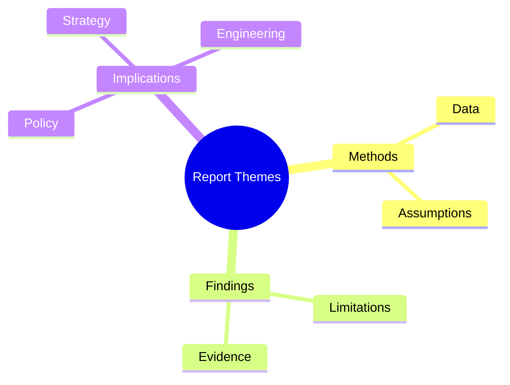
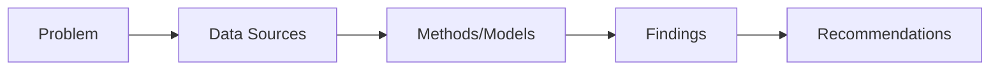

# JRC142598_01 — Executive Briefing
Subtitle: Comprehensive analysis and visuals  
Author: dzp5103  
Date: auto

---

## Agenda
1. Context & Objectives
2. Methodology
3. Key Findings
4. Visual Insights
5. Recommendations
6. Roadmap & Next Steps
7. Appendix

---

## Context & Objectives
- Context: [Populated post-ingestion]
- Objectives:
  - Extract and analyze full PDF
  - Synthesize findings
  - Provide actionable recommendations

---

## Methodology
- Parsing: PDF extraction + OCR fallback
- Analysis: Section-wise + evidence mapping
- Synthesis: Summaries, implications, risks

---

## Key Findings (Preview)
- Finding 1: [TBD]
- Finding 2: [TBD]
- Finding 3: [TBD]
- Evidence references: [page anchors]

---

## Visual Insight — Concept Map

---

## Visual Insight — Method / Data Flow

---

## Recommendations (Prioritized)
1) [TBD]  
2) [TBD]  
3) [TBD]

---

## Roadmap (Phased)
- Phase 1: Ingestion & parsing
- Phase 2: Analysis & synthesis
- Phase 3: Visuals & deck
- Phase 4: Review & publication

---

## Risks & Mitigations
- Access issues → Validate URL/upload
- OCR noise → Post-processing/validation
- Ambiguous figures → Manual inspection

---

## Next Steps
- Run workflow manually or push updates
- Review draft deliverables
- Finalize and publish

---

## Appendix
- Glossary
- References
- Figure/table catalog